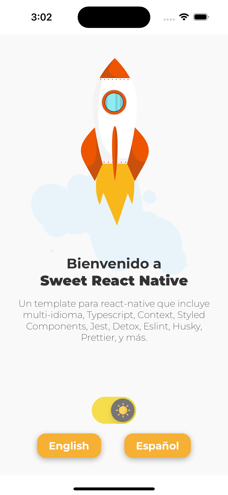

<h1 align="center">
  🚀
  
  <br>
    Sweet React Native
  <br>
  
</h1>

<h2 align="center">

&middot;

</h2>

<p align="center">Sweet React Native is a template for react native featuring Multi-language, Dark-Light Themes, Typescript, Context, Styled Components, Jest, Detox, Eslint, Husky, Prettier, and more.</p>
<br>

<p align="center">
  • <a href="https://www.youtube.com/shorts/-fnGqfFWh2k">Video Demo</a> •
</p>

<p align="center">
    
    
</p>

<br>
<br>
<br>
<br>
<p align="center">
    🚧
    <br>
    This project is under construction, PRs and suggestions<br>are always welcome.
    <br>
     🚧
</p>

## 📚 Table of Contents

- [Installation](#installation)
- [Run project](#run-project)
- [Rename the project](#renaming-project)
- [Imports](#imports)
- [Languages](#languages)
  - [Translate function](#translate-function)
  - [Translate with params](#translate-with-params)
  - [Change the language](#change-language)
  - [Get current language](#get-current-language)
- [Themes](#themes)

## Installation

Before starting, please make sure you have the [environment set up for react-native cli](https://reactnative.dev/docs/environment-setup).

#### Clone project

```sh
git clone https://github.com/nriccar/sweet-rn.git
```

#### Install dependencies

```sh
npm install
cd ios
pod install
```

## Run project

#### Available Scripts

- npm start - start metro bundler (react-native start)

## Renaming project

If you want to rename the packages of the project, I recommend using [react-native-rename](https://github.com/junedomingo/react-native-rename).
One of the tickets on the roadmap of this template is adding it as a template to the react-native cli command, so that you can `npx react-native init myPackageName --template sweet-rn`.

For the time being, just rename with react-native-rename and you will be good to go.

## Imports

Absolute imports are configured in `tsconfig.json` and `babel.config.js`. You can import whatever you want from `src` folder using the alias `@swrn` - `@swrn/components` for example.
If you want to change this alias, refer to `tsconfig.json` and `babel.config.js` file.

## Languages

Languages files are located in `src/locale`. In there you will see a `index.ts` file that exports all the languages. You can add as many languages as you want, just make sure to add the `lang_code.json` file to `src/locale`, and include it in locales in `src/locale/index.ts`.

#### Translate function

The translate function - `src/locale` - is a simple function that receives a key as a string and returns the text that key refer to in the json file.

```js
// en.json
{
  "hello_world": "Hello World!"
}

//
import { translate } from '@swrn/locale'
const text = translate('hello_world') // Hello World!
```

#### Translate with params

The translate function also accepts params, so that the translations can be more flexible.

```js
// en.json
{
  "there": "there",
  "app_name": "Sweet React Native",
  "hello_user_with_age": "Hello {0}, do you like {1} already?",
}

//
import { translate } from '@swrn/locale'
const text = translate('hello_user_with_age', ['there', 'app_name']) // Hello there, do you like Sweet React Native already?
```

Note that the params are an array of string of keys which refer to a translation in the file.

#### Change language

You may change the language of the app by using the `useLanguage` hook. This hook returns a function that receives a string with the language code and changes the language of the app.

```js
import { changeLanguage, translate } from '@swrn/locale'
import { useLanguage } from '@swrn/contexts/language'

[...]

const [, setLanguage] = useLanguage()

const handleLanguageChange = (value: 'en' | 'es') => {
  changeLanguage(value)
  setLanguage(value)
}
```

A fix for using just the hook is on the way. For now, you will have to use the `changeLanguage` too.

#### Get current language

You may get the current language of the app by using the `getLanguage` function from `src/locale`.

```js
import { getLanguage } from '@swrn/locale'
const currentLanguage = getLanguage() // en
```

Also, there's a `getAvailableLanguages` function that returns an array of strings with the available languages.

```js
import { getAvailableLanguages } from '@swrn/locale'
const availableLanguages = getAvailableLanguages() // [en, es]
```

## Themes

The dark-light theme is configured using the `useTheme` hook. This hook returns an object with the current theme and a function to change the theme.

```js

import { useTheme } from '@swrn/contexts/theme'

[...]

const [theme, setTheme] = useTheme()
```

You will find the palettes for each theme on `src/style/palette`. Note that there's a `defaultPalette` object for the shared colors between the themes.

There's also an example of a Switch component on `src/screens/app`.

```jsx
import Switch from '@swrn/components/switch'

import sun from '@swrn/assets/icons/sun.png'
import moon from '@swrn/assets/icons/moon.png'

[...]

const handleThemeChange = (value: boolean) => {
  setTheme(value ? 'light' : 'dark')
}

[...]

<Switch
  thumbImages={[sun, moon]}
  onSwitch={handleThemeChange}
  trackColors={['#767577', '#f5dd4b']}
  thumbColors={['#767577', '#f4f3f4']}
/>
```

<!-- | Parameter | Type     | Description                |
| :-------- | :------- | :------------------------- |
| `api_key` | `string` | **Required**. Your API key | -->

<br>
<br>
## 🚧 Roadmap 🚧

- Add to the react-native cli command, so that you can `npx react-native init myPackageName --template sweet-rn`.
- Fix the `useLanguage` hook, so that it doesn't require the `changeLanguage` function.
- Document providers, context, hooks, components, eslint, husky, prettier.
